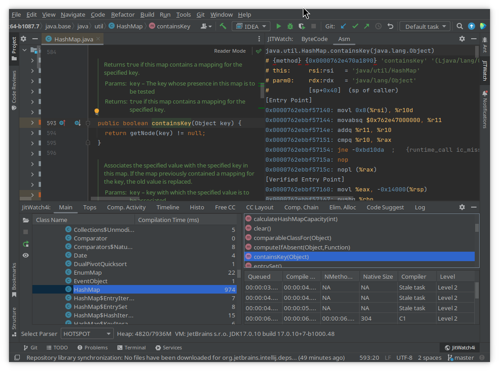
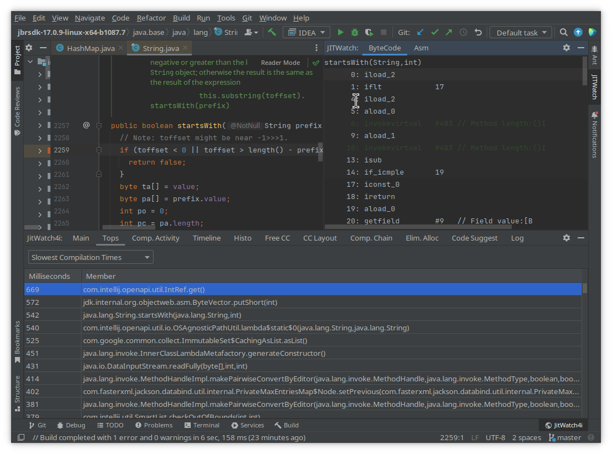
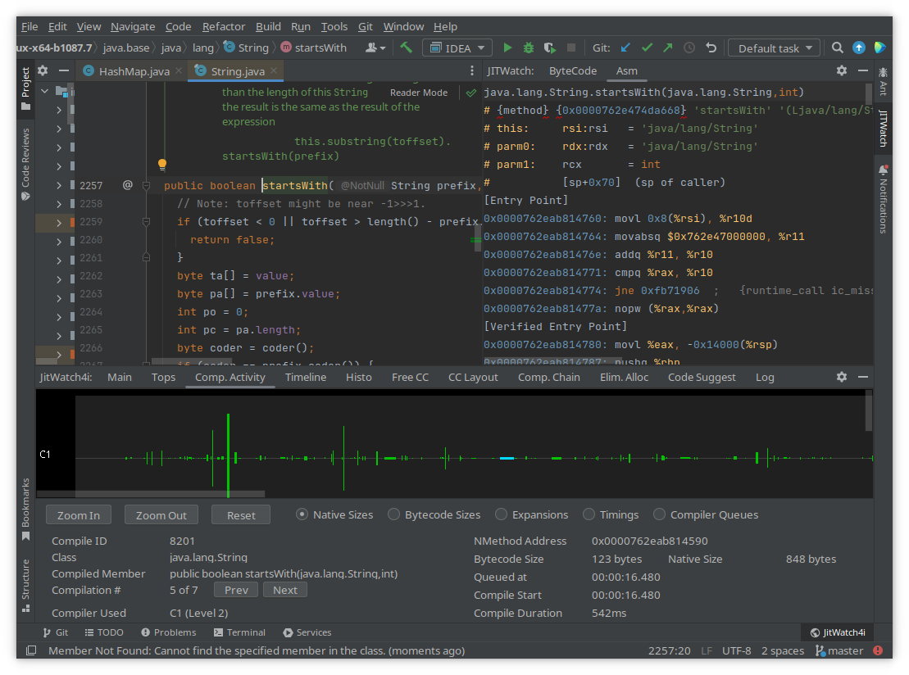
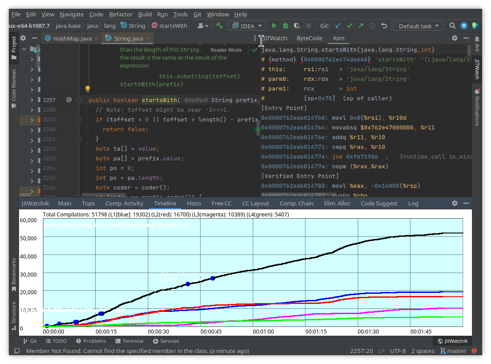
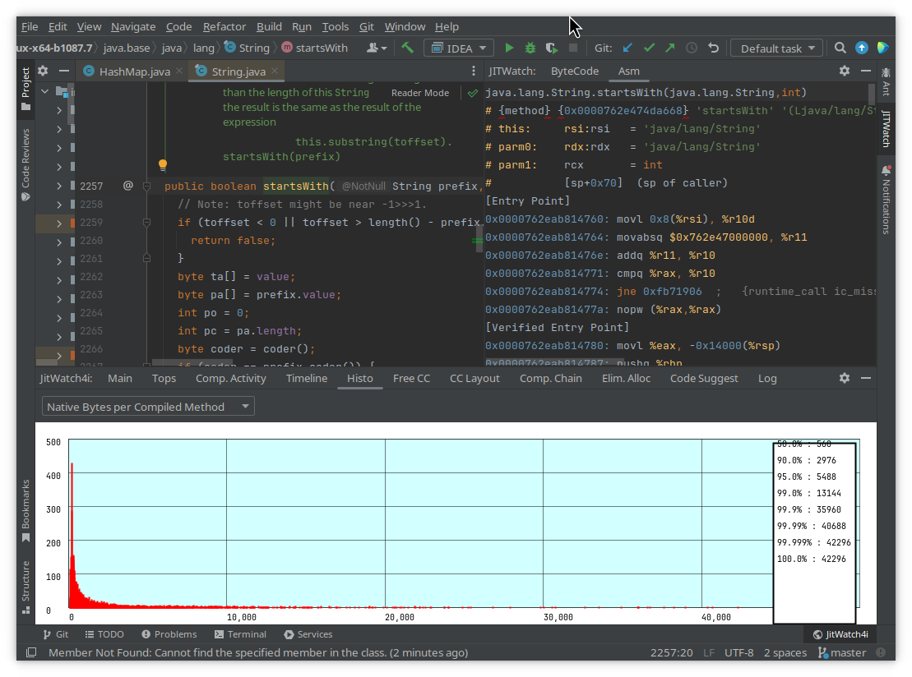
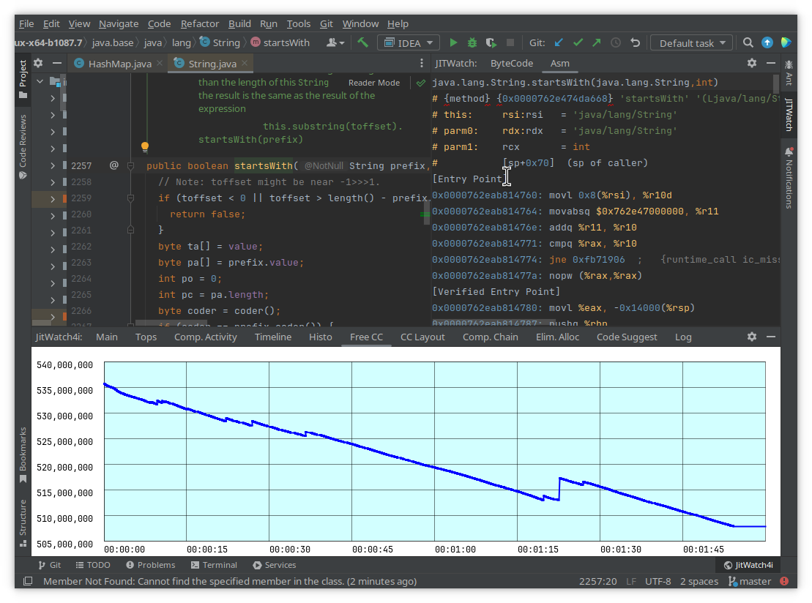
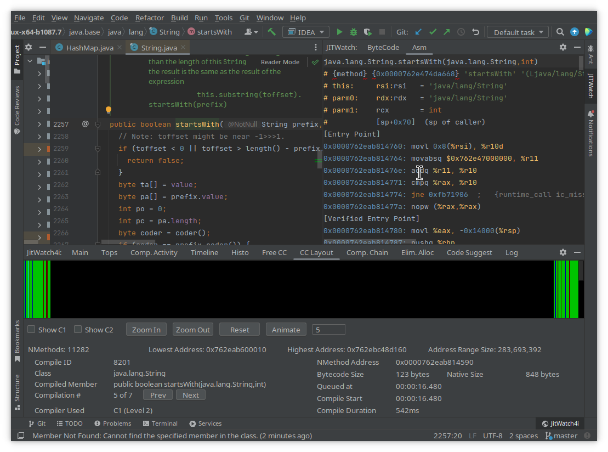
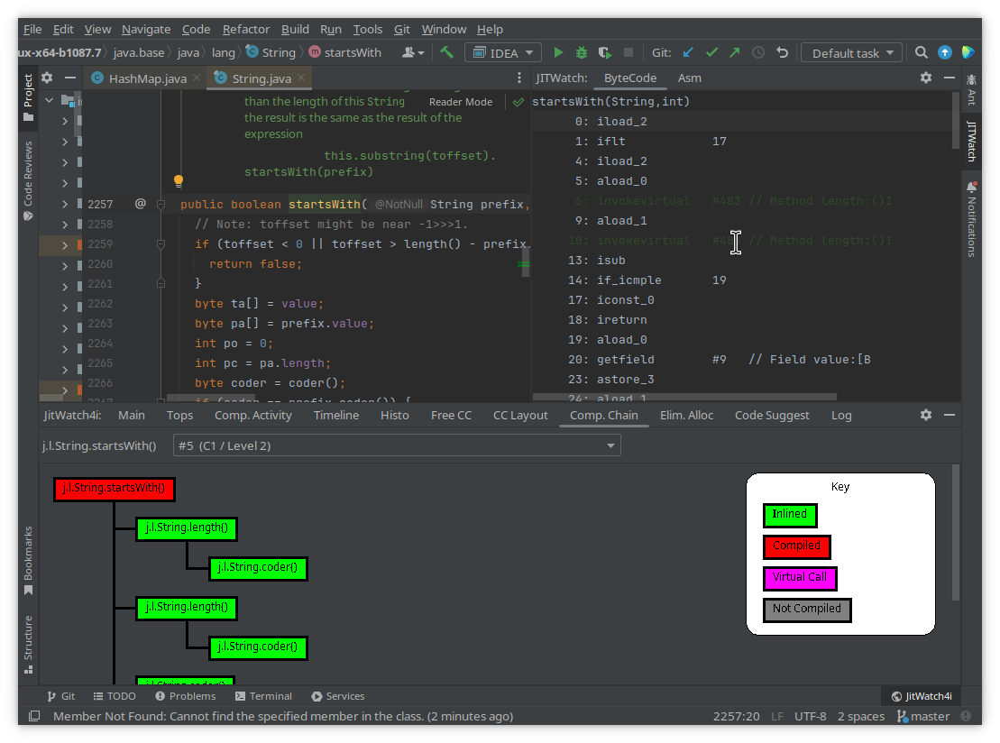
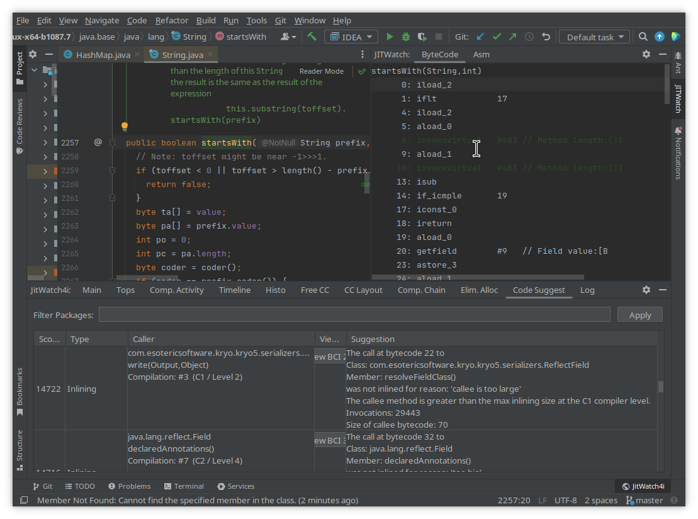

JITWatch4i
===

[![Contributions welcome][contributions-welcome-svg]][contributions-welcome]
[](https://plugins.jetbrains.com/plugin/25979-jitwatch4i)

<!-- TOC -->
* [JITWatch4i](#jitwatch4i)
  * [Features](#features)
  * [Overview](#overview)
    * [Creating and Opening a Compilation Log](#create-logs)
    * [Toolwindow](#toolwindow)
      * [Main](#main)
      * [Top Lists](#top-lists)
      * [Compilers' Activity](#compilers-activity)
      * [Time Line](#time-line)
      * [Histograms](#histograms)
      * [Free Code Cache](#free-code-cache)
      * [Code cache layout](#code-cache-layout)
      * [Compilation Chain](#compilation-chain)
      * [Code Suggest](#code-suggest)
    * [Editor](#editor)
  * [Installation](#installation)
  * [Credits](#credits)
<!-- TOC -->


Analysis and visualization of logs and assembly code from the JVM JIT (Just-In-Time) compiler, Built as a Plugin for IntelliJ IDEA.
It is based on the foundations of [JitWatch](https://github.com/AdoptOpenJDK/jitwatch) by Chris Newland and 
[jitwatch-intellij](https://github.com/yole/jitwatch-intellij) by Dmitry Jemerov.


## Features

- **Compiled packages/classes/methods**: Lists compiled methods organized in a package-class tree, shows compilation times, 
  optimization levels (L1–L4), and compiler type.
- **Analysis**: Provides a range of tools to visualize and analyze JIT compilation data, including activity timelines, 
  memory usage, and performance metrics.
- **Code Integration**: Displays bytecode and assembly code side-by-side with the original Java source, with syntax highlighting.


## Overview

### Creating a Compilation Log

To analyze JIT compilation data using the plugin, you need to have a compilation log. If one does not already exist, 
you can easily create it by enabling the "Log compilation" option in your run configuration settings. When enabled, 
this will generate a HotSpot log in a temporary directory.

Alternatively, you can add the logging options to the VM options of your run configuration, and then load the log file 
manually. To enable logging, you need the following options:
```
-XX:+UnlockDiagnosticVMOptions
-XX:+TraceClassLoading
-XX:+LogCompilation
-XX:+PrintAssembly
```

### Opening a Compilation Log

After creating the compilation log, simply open it in the plugin. JITWatch4i will automatically parse the log and 
present the resulting analysis in tabs in toolwindow.

### Toolwindow

#### Main
Lists compiled methods organized in a class tree, shows compilation times, optimization levels (L1–L4), and compiler type.


#### Top lists
Tab "Tops" Displays methods ranked by various metrics, including the largest generated code, longest compilation times, most 
frequent deoptimizations, and failed inlining attempts.


#### Compilers Activity
Shows compilers' thread activity over time, with compilations represented by rectangles sized by generated code. Compilations are selectable.


#### Time Line
Shows a timeline of compilations categorized by optimization levels (L1–L4), illustrating how compilation activity changes over time. Levels L1+L2+L3 are compiled by C1, L4 is compiled by C2.


#### Histograms
Tab "Histo" provides histograms to analyze the distribution of compiled code sizes, compilation durations, and sizes of inlined methods.


#### Free Code Cache
Tracks the allocated memory in the Code Cache over time.


#### Code Cache Layout
Tab "CC Layout" displays a detailed layout of the Code Cache memory.


#### Compilation Chain
Tab "Comp Chain" shows the compilation structure of methods, including inlined methods and external calls.


#### Code Suggest
Identifies performance-critical areas such as:
  - **Hot Methods**: shows info about methods that were not inlined, with reasons for inlining failures.
  - **Branch Prediction**: identifies unpredictable branches that impact performance.



### Editor

The editor provides seamless integration with the plugin's features. The **Jitwatch** tool window on the right edge 
displays a synchronized view of the bytecode and assembly code for the currently selected method. As you navigate 
through the source code in the editor, the bytecode and assembly views automatically update to reflect 
the corresponding position.

## Installation

- Using the IDE built-in plugin system:

  <kbd>Settings/Preferences</kbd> > <kbd>Plugins</kbd> > <kbd>Marketplace</kbd> > <kbd>Search for "jitwatch4i"</kbd> >
  <kbd>Install</kbd>

### Credits
This plugin is based on:
- [JitWatch](https://github.com/AdoptOpenJDK/jitwatch) by Chris Newland.
- [jitwatch-intellij](https://github.com/yole/jitwatch-intellij) by Dmitry Jemerov


[contributions-welcome-svg]: http://img.shields.io/badge/contributions-welcome-brightgreen
[contributions-welcome]: https://github.com/JetBrains/jitwatch4i/blob/master/CONTRIBUTING.md
